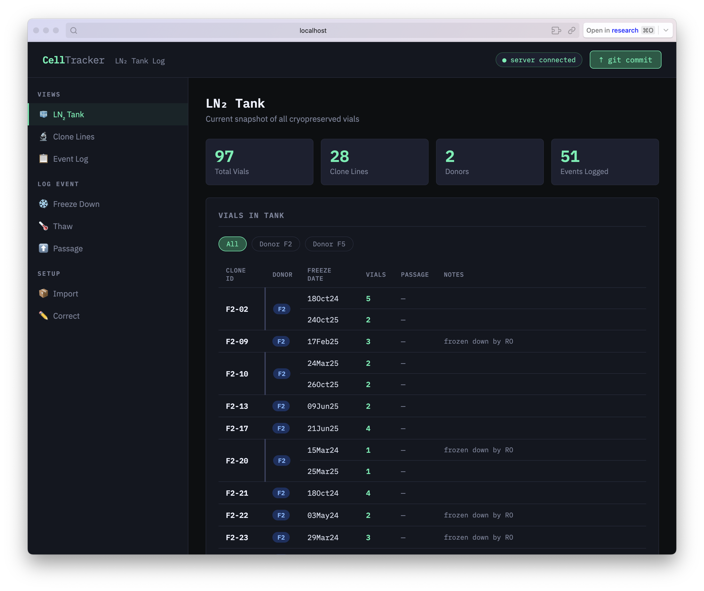
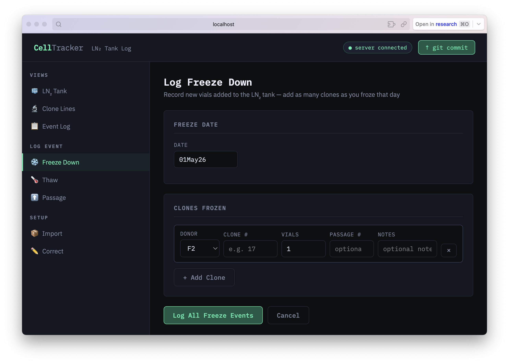
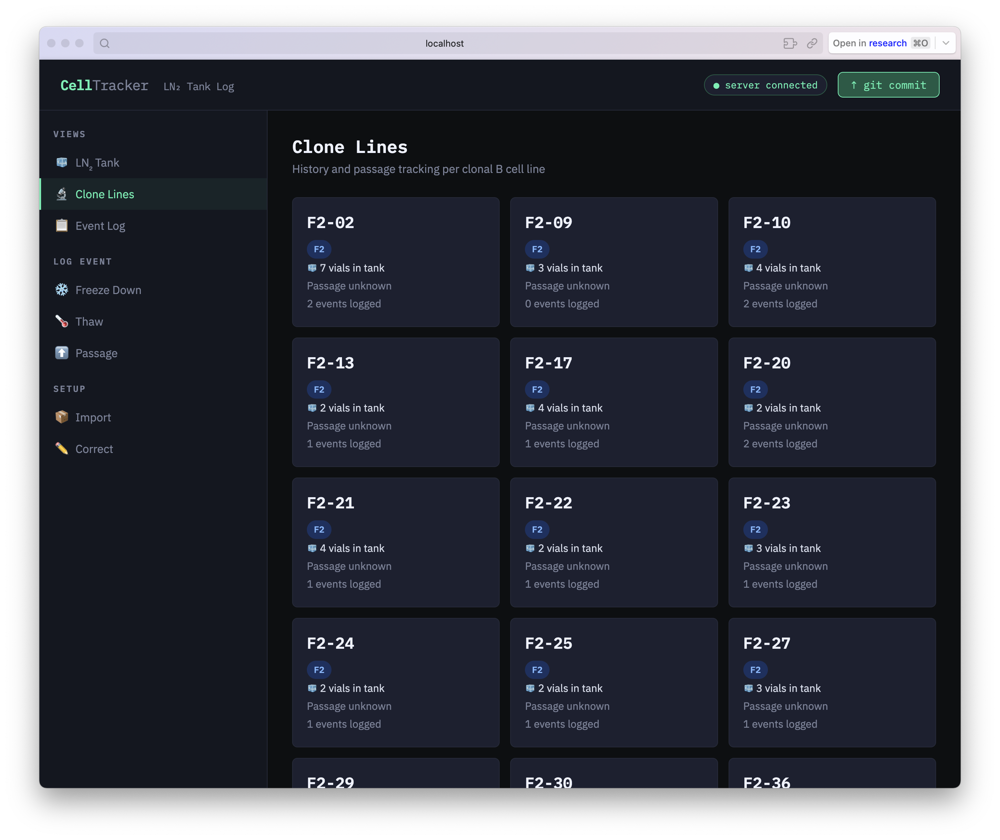
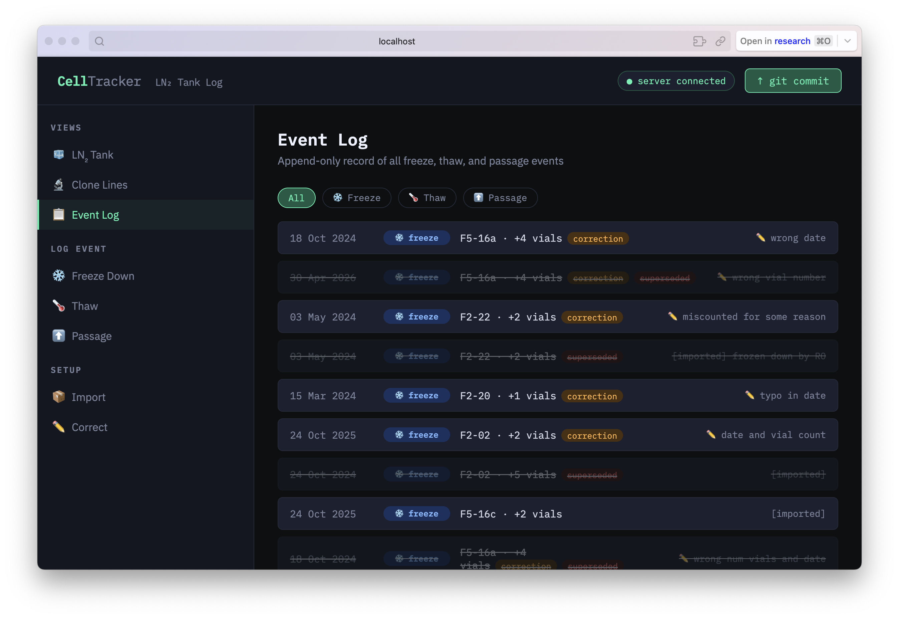

\*made with Claude Pro. shoutout to Roseann

# Welcome 2 My Bank 🧬

A local web app for tracking clonal B cell lines, LN₂ tank inventory, and passage history. All data lives as plain JSON files in a git repo — no database, no hosting, no cost.

## Pages

| Page | Purpose |
|------|---------|
| 🧊 **LN₂ Tank** | Current vial inventory, grouped by clone. Click a clone to see its detail. |
| 🔬 **Clone Lines** | Card view per clone, passage tracking, event history popup. |
| 📋 **Event Log** | Full append-only log of all events. |
| ❄️ **Freeze Down** | Log new vials into the tank (batch entry, one date, multiple clones). |
| 🌡️ **Thaw** | Log vials being removed from the tank. |
| ⬆️ **Passage** | Log passage events per clone batch. |
| 📦 **Import** | One-time bulk setup from lab notebooks (per-row dates in `ddMMMyy` format). |
| ✏️ **Correct** | Fix the current tank snapshot — edit count, passage, notes, or freeze date for any batch. Logs a correction event to the audit trail. |

## Workflow

1. **First time:** Use **Import** to enter your current inventory. Each freeze-down event (same clone, same date) is one row.
2. **Every freeze:** Use **Freeze Down** — set date once, add a row per clone frozen.
3. **Every thaw:** Use **Thaw** to log vials removed.
4. **Every passage:** Use **Passage** to record passage events per clone batch.
5. **Made a mistake?** Use **Correct** — pick the clone, edit the batch directly, add a reason. The original is preserved in the log.
6. **After any session:** Click **↑ git commit** (top right) to snapshot everything.

## Setup (one time)

```bash
# 1. Put the celltracker folder somewhere permanent
cd ~/celltracker

# 2. Initialize git repo
git init
git add .
git commit -m "Initial CellTracker setup"

# 3. Optionally push to a private GitHub repo:
gh repo create celltracker --private --source=. --push
# or via SSH:
git remote add origin git@github.com:YOURUSER/celltracker.git
git push -u origin main
```

## Running

```bash
cd ~/celltracker
python3 server.py
# Then open http://localhost:8787 in your browser
```

No npm, no dependencies, no internet required.

## Date format

All dates use lab-notebook format: `ddMMMyy` — e.g. `23Apr25`, `01Jan26`. Both 2- and 4-digit years work. Lowercase months work too (`23apr25`).

## Data files

- `data/vials.json` — current LN₂ tank state (what's physically in the tank right now)
- `data/events.json` — append-only event log (never deleted from; corrections add new entries)

Passage number is stored per freeze batch, not per clone line. If batches differ, the Clone Lines view shows a range (e.g. `P3–P5`).

## Git history = version control

Every commit is a complete snapshot. Useful commands:

```bash
git log --oneline                      # all snapshots
git show HEAD:data/vials.json          # tank state at latest commit
git diff HEAD~1 data/events.json       # what changed since last commit
git show <hash>:data/vials.json        # tank state at any point in time
```

## Bulk import via JSON

Paste into **Import → Bulk JSON Import**:

```json
[
  {"donor": "F5", "clone": "17", "freeze_date": "2025-04-23", "count": 3, "passage": 4, "notes": "from old lab member"},
  {"donor": "F2", "clone": "3",  "freeze_date": "2025-03-10", "count": 2}
]
```

Note: `freeze_date` in bulk JSON uses ISO format (`YYYY-MM-DD`); the UI form uses `ddMMMyy`.

## How It Looks

### LN₂ Tank
The tank page shows all vials currently in the LN₂. Clones with multiple freeze batches are grouped together — clone ID and donor appear once on the left spanning all rows, with each batch on its own line showing freeze date, vial count, passage number, and notes. Click any clone ID to open a detail popup with full batch breakdown and event history.


### Freeze Down
Log a freeze-down session: set the date once at the top, then add a row per clone. Donor defaults to the row above for fast entry. Dates use lab-notebook format (`ddMMMyy`, e.g. `23Apr25`).


### Clone Lines
Card view of every clone line. Shows total vials in tank, current passage (or range if batches differ), and event count. Click any card for the full detail popup.


### Event Log
Append-only log of every freeze, thaw, passage, and correction event. Filterable by type. Superseded (corrected) entries are struck through; corrections show with an amber badge and reason.

